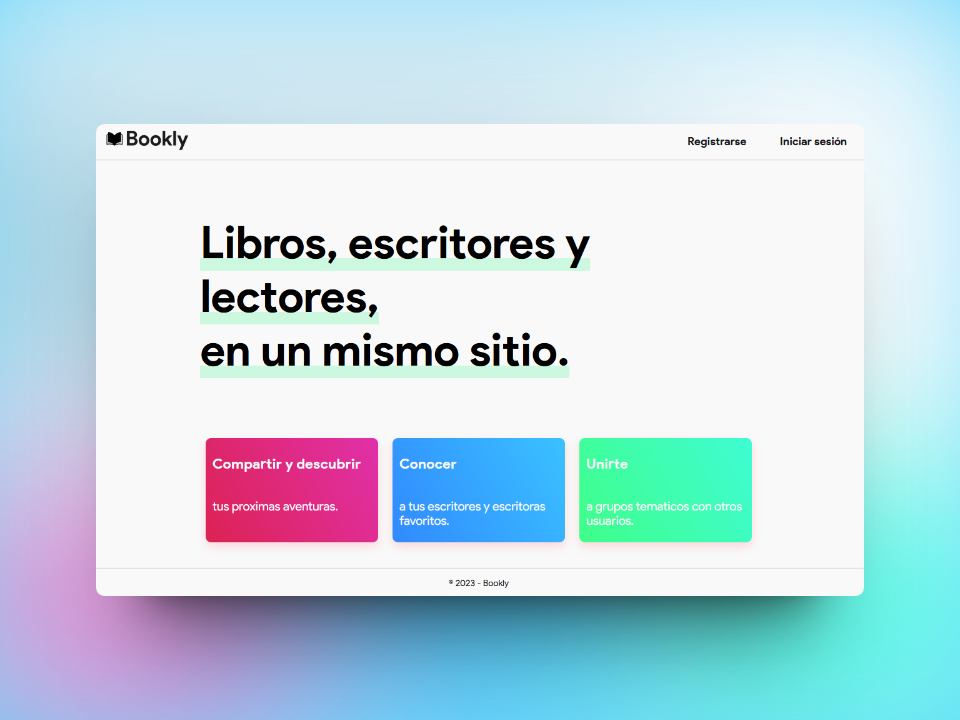

# 📖 Bookly

Red social para aficionados a la lectura.

Los usuarios pueden publicar posts, buscar y seguir a otros usuarios, explorar libros...

## Stack
- Django.
- Django REST Framework.
- SQLite.

## Deployment

Pasos para iniciar la aplicación:

#### Instalar dependencias
```bash
  pip install -r requirements.txt
```

#### Generar base de datos con modelos
```bash
  python manage.py migrate
```

#### Iniciar aplicación
```bash
  python manage.py runserver
```

<p align="center">

</p>
